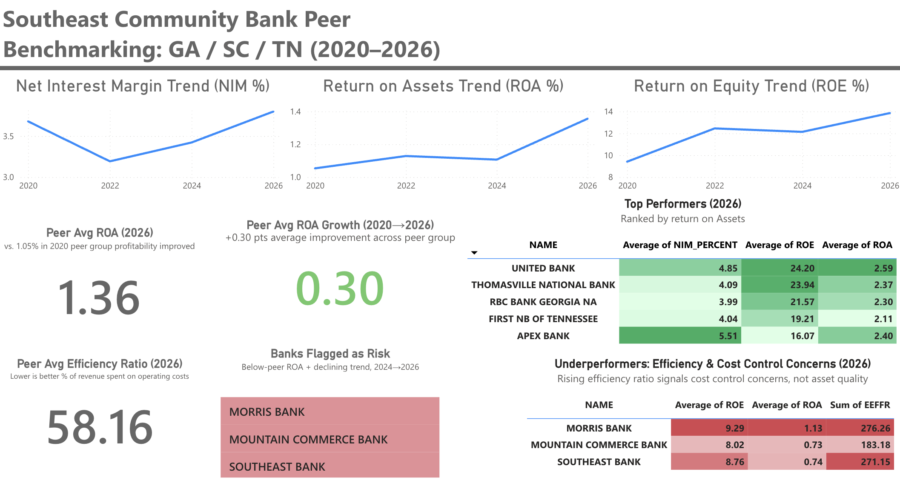

Southeast Community Bank Peer Benchmarking Dashboard

Peer benchmarking analysis of Southeast U.S. community banks ($1B–$10B in assets) using FDIC financial data, SQL, and Power BI. Identifies profitability trends, peer rankings, and efficiency-driven risk flags to show where a bank stands relative to its peer group and where it should focus improvement efforts.

## Dashboard Preview

Key Findings
Peer group profitability improved overall (2020–2026). Average ROA grew from 1.05% to 1.36%; average ROE grew from 9.41% to 13.85%.
Net interest margin compressed during the 2022–2024 rate-hike cycle, dropping from 3.68% to 3.19%, before recovering to 3.80% by 2026 — a sector-wide pattern, not a bank-specific issue.
Performance spread across peers is wide. Top performer United Bank posted 2.59% ROA in 2026, while the lowest performer, Morris Bank, posted -0.45% — despite both being in the same asset-size peer group.
Three banks were flagged as underperforming and declining (Morris Bank, Southeast Bank, Mountain Commerce Bank). Their efficiency ratios (a measure of operating cost relative to revenue) rose sharply — Morris Bank's efficiency ratio climbed from 62.7% to 106.1% between 2024 and 2026 — while their loan quality metrics stayed clean. This points to a cost-control problem, not a credit-risk problem.
Growth leaders worth studying: One Bank of Tennessee, Bank of Travelers Rest, and Georgia Banking Co. posted the strongest ROA improvement from 2024 to 2026, and could serve as internal benchmarks for the stakeholder's own bank.
Recommendation

The stakeholder bank should benchmark its own efficiency ratio against this peer set on a quarterly basis. If it shows a pattern similar to the flagged banks — efficiency ratio climbing faster than the peer average — the recommended first step is an operating expense review, not a credit-risk review, since asset quality was not the driver of underperformance in this dataset.

Overview

This project benchmarks Southeast U.S. community banks (Georgia, South Carolina, and Tennessee) with $1B–$10B in total assets, using data from the FDIC's BankFind Suite.

Tools Used
Excel — data cleaning, validation, and unit correction
SQL (SQLite) — peer group averages, rankings, year-over-year growth (self-joins), and risk-flag identification (CTEs)
Power BI — interactive dashboard with trend charts, peer rankings, and conditional formatting
Data Source

FDIC BankFind Suite, Financial Reports tool (banks.data.fdic.gov/bankfind-suite/financialreporting). Data pulled for Q1 2020, Q1 2022, Q1 2024, and Q1 2026 across Georgia, South Carolina, and Tennessee, filtered to banks with $1B–$10B in total assets (179 bank-year records, 67 unique banks).

Process
Data Collection — Pulled 12 raw CSV exports (3 states × 4 years) directly from the FDIC.
Data Cleaning (Excel) — Combined all 12 files into one master table. Converted date fields, validated the join key (CERT number, not bank name, since names were found to be inconsistently spelled across years), flagged banks with complete 4-year history, and caught a units error in the raw NIM field (it was reported in dollars, not as a percentage — the correct percentage metric, NIMY, was substituted in).
SQL Analysis — Calculated peer group averages by year, ranked banks against the peer average, computed year-over-year ROA growth using a self-join, and identified underperforming/declining banks using a CTE.
Power BI Dashboard — Built trend visualizations, KPI summary cards, and color-coded ranking tables to present findings clearly.
Repo Contents
Bank_Peer_Analysis_Master.xlsx — full workbook, including raw data by state/year and the cleaned, combined master table
Master_Combined.csv — the cleaned, combined dataset used for SQL analysis (179 records, 67 unique banks)
queries.sql — SQL queries for peer averages, rankings, YoY growth, and risk flagging
BankDashboard.png — screenshot of the final Power BI dashboard
